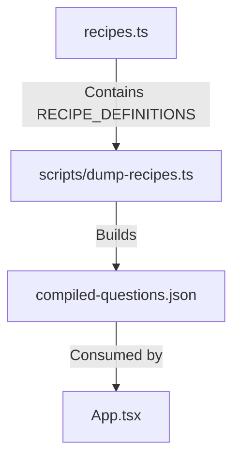

# Architecture

*Mapped: 2026-02-03*

## Project Structure Overview

| Directory | Purpose |
|-----------|---------|
| `src/` | Main application source code (implied root structure) |
| `components/` | React UI components (likely reusable parts) |
| `services/` | Business logic and helper functions |
| `scripts/` | Build and utility scripts (e.g., generating JSON data) |
| `hooks/` | Custom React hooks |
| `assets/` | Static assets |

## Tech Stack

- **Runtime:** Node.js (implied by `package.json` scripts)
- **Language:** TypeScript
- **Framework:** React 19 (Vite)
- **Key Dependencies:**
  - `react-simple-code-editor` / `prismjs`: For code editing and highlighting in the UI.
  - `lodash`: Utility functions.
  - `d3` / `recharts`: Data visualization.

## Data Flow: Question Bank

The core data of the application (the question bank) follows a specific generation flow:

1.  **Source of Truth:** `recipes.ts` defines the `RECIPE_DEFINITIONS` array containing all questions/recipes.
2.  **Build Step:** `npm run dump` executes `scripts/dump-recipes.ts`.
3.  **Artifact:** This script serializes the TypeScript definitions into `compiled-questions.json`.
4.  **Runtime:** The application likely loads this JSON (or the TS file directly) to display questions.

## Entry Points

- `index.html`: Web entry point.
- `index.tsx`: React root rendering.
- `App.tsx`: Main application component.
- `recipes.ts`: **Data Entry Point** - The single source of truth for the question bank content.
- `scripts/dump-recipes.ts`: Tooling entry point for data generation.
